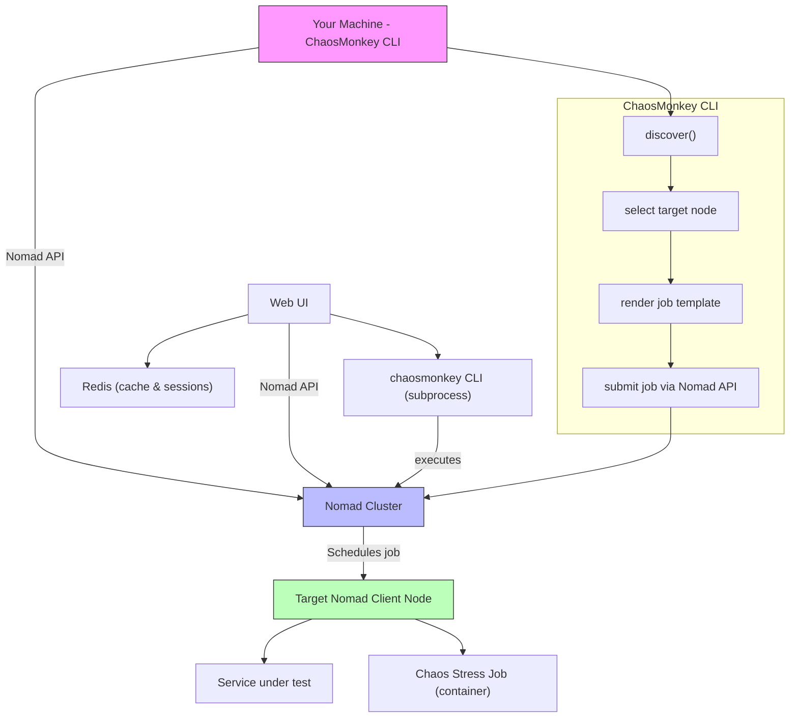
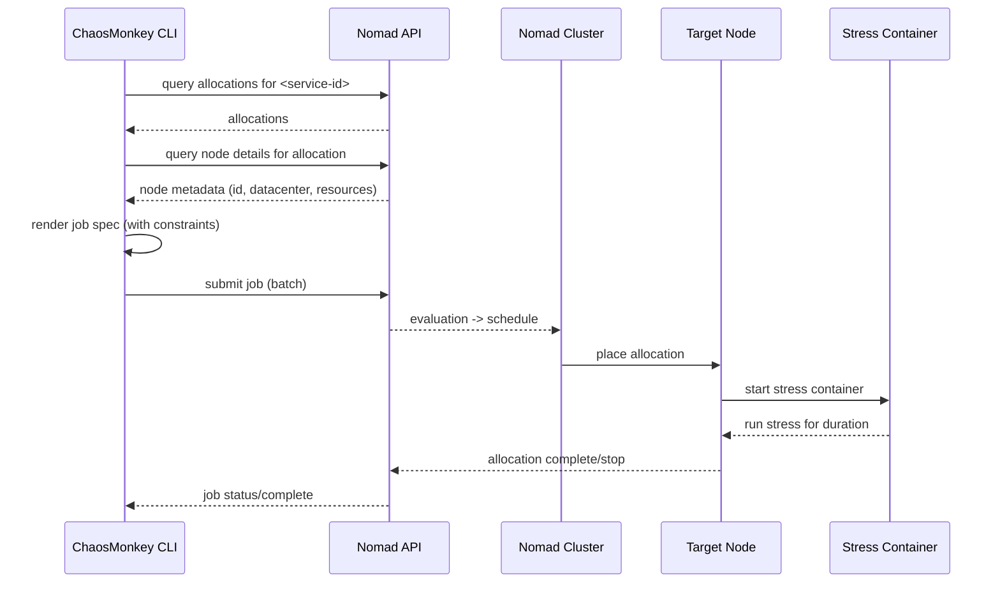

# Architecture & Implementation Diagrams

This file contains machine-friendly diagrams (Mermaid) that illustrate the ChaosMonkey architecture and the deployment sequence when executing an experiment against Nomad-managed services. If your Markdown renderer supports Mermaid you'll see the flowchart and sequence diagrams rendered inline. Otherwise an ASCII fallback is provided below each diagram.

## High-level Architecture (Mermaid)



ASCII fallback:

```
Your Machine (ChaosMonkey CLI)
  ├─ discover() -> select target node
  ├─ render job template
  └─ submit job via Nomad API
Web UI
  └─ Queries Nomad API and caches results in Redis
       |
       v
  Nomad Cluster
    └─ schedules job -> places on target node
           |
           v
  Target Nomad Client Node
    ├─ Service under test
    └─ Chaos Stress Job (container)
```

## Deployment Sequence (Mermaid sequence diagram)



ASCII fallback:

```
1) CLI queries Nomad for allocations of the target service
2) CLI finds the node id and datacenter
3) CLI renders a Nomad batch job with a node constraint
4) CLI submits job via Nomad API
5) Nomad schedules the job and places it on the target node
6) The stress container starts and runs for the configured duration
7) Job stops and Nomad reports completion back to CLI
```

## Notes and mapping to code

- Discovery and orchestration: `src/chaosmonkey/core/nomad.py` and `src/chaosmonkey/core/orchestrator.py`
- Template rendering: `src/chaosmonkey/core/experiments.py`
- Concrete CPU stress action: `src/chaosmonkey/stubs/actions.py` (function `run_cpu_stress()`)
- Web UI: `src/chaosmonkey/web` (Flask app that provides dashboard, execute UI, and reports viewer)
- Redis (optional): used by the Web UI for caching node lists, reports, and session data. Configure via `REDIS_URL` environment variable when running the Web UI.
 - CLI usage by Web UI: for some endpoints the Web UI invokes the `chaosmonkey` CLI via subprocess (see `run_cli_command` in `src/chaosmonkey/web/app.py`). Endpoints using the CLI include `/api/execute`, `/api/chaos-jobs`, and `/api/discover/services`.

  Recommendations:
  - Run the Web UI in the same Python environment where the `chaosmonkey` package/CLI is installed (or ensure `chaosmonkey` is on the PATH).
  - Consider invoking the CLI with the running interpreter to avoid PATH issues: `sys.executable -m chaosmonkey ...`.
  - Longer-term: replace subprocess calls with direct library calls into `ChaosOrchestrator`/core APIs to remove overhead and improve robustness.

## Rendering tips

- GitHub supports Mermaid in Markdown. If a diagram doesn't render, try enabling the "Mermaid" preview in your editor or install a Mermaid preview extension for VS Code.
- Use the ASCII fallbacks when rendering is not available.

---

End of diagrams.
